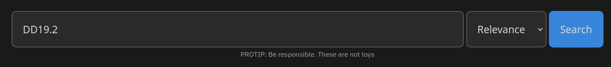
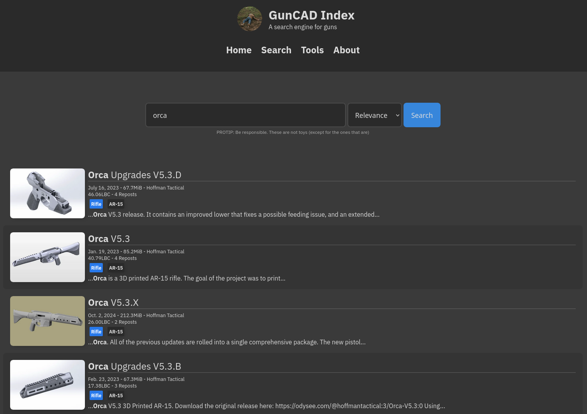
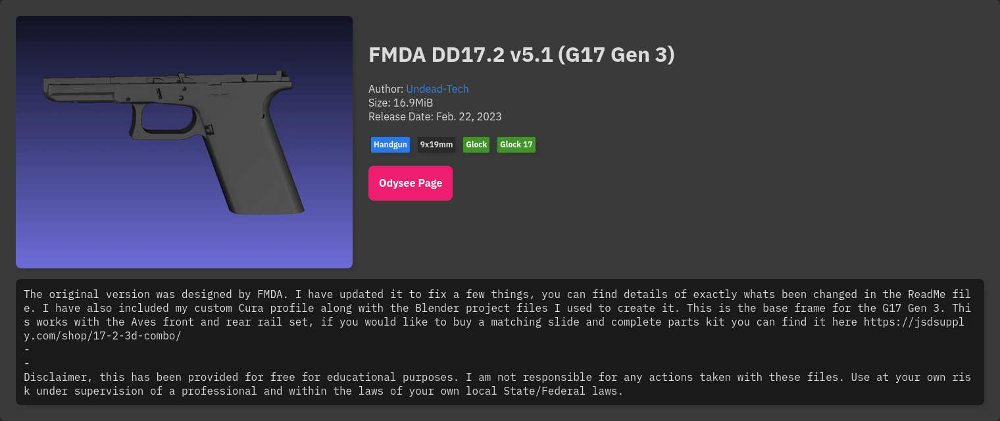
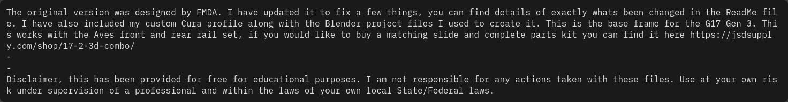
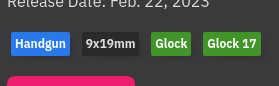

# GunCAD Index User Manual

GunCAD Index is a **search engine for gun designs**. It has a number of features that make searching quick, efficient, and easy.

## Basic Usage

### Searching

To search the index:

1. Input a query into the search bar that relates to what you'd like to see, such as "Glock 17", "DB Alloy", "CETME C", etc.

2. (Optional) If you'd like to choose how your results are sorted, pick a sorting method from the dropdown menu next to the "Search" button

3. Hit "Enter" on your keyboard or press the "Search" button

### Navigating Search Results

Once you've submitted a query, you'll be taken to a page where you can browse the results. Your query, unless you were very specific or looked for something pretty niche, likely has multiple pages to it -- use the paginator at the bottom of the page to advance to navigate between pages of results:

Click on a release to go to its "details" page:

A few things of note:

| Element | Notes |
| ------- | ----- |
|  | Click this button to be taken to the download page for the release on Odysee. |
|  | The full description of the release can be viewed here. It often contains notes and instructions that are important. This information can also be viewed on Odysee. |
|  | Click this link to initiate a search for other releases from this author |
|  | A list of tags (if any) will be displayed here. Tags can be hovered over for a longer description and clicked to initiate a search for other releases with the same tag. |

### Sorting Results

Results can be sorted using the drop-down next to the "Search" button:

* "Relevance" only matters when you specify a search query. Releases that more closely match what you're asking for will be closer to the top. Results are also, in this mode, weighted by how popular they are -- support your favorite creators by boosting their claims with LBC and reposting.

* "Newest"/"Oldest" will put the newest/oldest results at the top, provided they match your search query (if specified)

* "Biggest"/"Smallest" will put the largest/smallest files at the top, similar to the above

* "Popular" prioritizes the effective price of the claim (how big the little LBC number is next to the description on Odysee) above all else

* "Random" will do exactly what you think it does and shuffle your search results. You can use this for some fun discovery if you get bored. In this mode, the paginator at the bottom will be replaced with a "reroll" button, since the concept of moving to the next page kinda doesn't make any sense.

## Advanced Usage

### No Search Query

You can submit the form with no search query to just show everything. "Relevance" sorting just becomes "Newest", but all the other sorting options work. You can use this to get a batch of 20 random releases if you want.

### Complex Search Queries

The search engine used to navigate the index is, at its core, PostgreSQL's websearch engine. It supports some basic Google-like filtering and boolean operators:

| Example | Notes |
| ------- | ----- |
| `"Glock 17"` | Quoting a phrase stops the search engine from delimiting keywords at spaces and thus matches the whole string. It does **not** make the query case-sensitive. |
| `ar-15 or ar-10` | Stop words like `the` are usually filtered out, but `or` is used as a boolean operator that can match either half of the query. |
| `ar-15 and monolithic or ar-10` | The `or` splits the two halves perfectly -- this is more like `(ar-15 && monolithic) || (ar-10)`. |
| `Glock -19 -26 -20` | Prefixing a keyword with a `-` requires that it not be present. |
